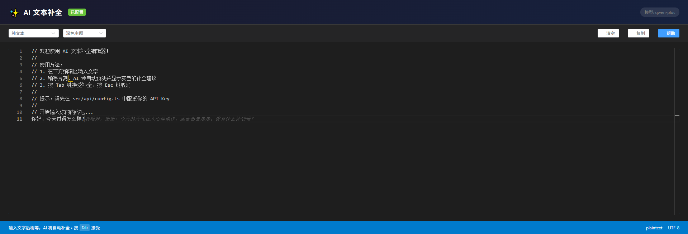

# Spectre - AI 文本补全编辑器

> 🌫️ 像幽灵一样悄然出现的智能补全

基于 Vue 3 + Monaco Editor 实现的 AI 文本补全功能，类似于 Cursor/Copilot 的代码补全体验。输入文字后，AI 会自动预测并以灰色"幽灵文字"显示补全建议，按 Tab 即可接受。



## ✨ 功能特性

- 🌫️ **智能补全** - 输入文字后自动触发 AI 补全，灰色幽灵文字提示
- 🚀 **流式输出** - 实时显示 AI 生成内容，无需等待
- ⌨️ **快捷键支持** - Tab 接受补全，Esc 取消
- 🎨 **多主题切换** - 支持深色/浅色/高对比度主题
- 📝 **多语言支持** - 支持多种编程语言语法高亮
- 🔌 **兼容 OpenAI API** - 可对接任何兼容 OpenAI 格式的 API

## 🛠️ 技术栈

- Vue 3 + TypeScript + Vite
- Monaco Editor (VS Code 同款编辑器)
- Element Plus UI 组件库
- OpenAI Node.js SDK / Dify Workflow API
- Pinia 状态管理
- VueUse 工具库

## 🚀 快速开始

### 1. 安装依赖

```bash
pnpm install
```

### 2. 配置 API

项目支持两种 AI 服务接入方式：**OpenAI** 和 **Dify Workflow**

#### 方式一：使用 OpenAI（或兼容服务）

复制样例配置文件并填入你的 API 信息：

```bash
cp src/api/config.local.example.ts src/api/config.local.ts
```

然后编辑 `src/api/config.local.ts`：

```typescript
export const AI_CONFIG: AIConfig = {
  // 选择 OpenAI 作为提供商
  provider: 'openai',
  
  openai: {
    // API 基础地址
    baseURL: 'https://api.openai.com/v1',
    
    // API 密钥
    apiKey: 'sk-your-api-key-here',
    
    // 模型名称
    model: 'gpt-3.5-turbo',
    
    // 其他参数...
  },
  
  // ...
}
```

**支持的 OpenAI 兼容服务：**

| 服务 | baseURL |
|------|---------|
| OpenAI | `https://api.openai.com/v1` |
| Azure OpenAI | `https://your-resource.openai.azure.com/openai/deployments/your-deployment` |
| 通义千问 | `https://dashscope.aliyuncs.com/compatible-mode/v1` |
| 本地 Ollama | `http://localhost:11434/v1` |
| 其他兼容服务 | 自定义地址 |

#### 方式二：使用 Dify Workflow

编辑 `src/api/config.local.ts`：

```typescript
export const AI_CONFIG: AIConfig = {
  // 选择 Dify 作为提供商
  provider: 'dify',
  
  dify: {
    // Dify API 基础地址
    baseURL: 'http://your-dify-server/v1',
    
    // Dify API 密钥
    apiKey: 'app-xxxxxxxxxx',
    
    // 输入变量名称（你在 Dify workflow 中定义的变量名）
    inputVariable: 'inputText',
    
    // 响应模式：streaming（推荐）或 blocking
    responseMode: 'streaming'
  },
  
  // ...
}
```

> 💡 详细的 Dify 接入指南请查看 [DIFY_INTEGRATION.md](./docs/dify/DIFY_INTEGRATION.md)

> 💡 `config.local.ts` 已被 `.gitignore` 忽略，不会提交到 Git，你的 API Key 是安全的。

### 3. 启动开发服务器

```bash
pnpm dev
```

访问 http://localhost:3000

## 📖 使用方法

1. 在编辑器中输入文字
2. 稍等片刻（默认 500ms 防抖），AI 会自动生成补全建议
3. 补全建议以灰色"幽灵文字"显示在光标后
4. 按 **Tab** 键接受补全
5. 按 **Esc** 键取消补全

## 📁 项目结构

```
src/
├── api/
│   ├── config.ts               # 类型定义和提示词
│   ├── config.local.ts         # 本地 API 配置（不提交 Git）
│   ├── config.local.example.ts # 配置样例文件
│   ├── openai.ts               # OpenAI 客户端封装
│   └── index.ts                # 模块导出
├── components/
│   └── AiEditor.vue            # AI 编辑器组件
├── composables/
│   └── useAiCompletion.ts      # AI 补全逻辑 Hook
├── constants/
│   └── storage.ts              # 存储键枚举
├── views/
│   └── HomeView.vue            # 首页视图
├── router/
│   └── index.ts                # 路由配置
├── store/
│   └── index.ts                # Pinia 状态管理
├── styles/
│   └── main.scss               # 全局样式
├── App.vue
└── main.ts
```

## ⚙️ 配置选项

在 `src/api/config.local.ts` 中可配置以下选项：

### 通用配置

| 参数 | 类型 | 默认值 | 说明 |
|------|------|--------|------|
| provider | string | `openai` | AI 服务提供商：`openai` 或 `dify` |

### 自动补全配置

| 参数 | 类型 | 默认值 | 说明 |
|------|------|--------|------|
| autoComplete.minTriggerLength | number | 5 | 触发补全的最小字符数 |
| autoComplete.debounce.normal | number | 500 | 正常编写时的防抖延迟 (ms) |
| autoComplete.debounce.newLine | number | 200 | 换行时的防抖延迟 (ms) - 快速响应 |
| autoComplete.debounce.paste | number | 1000 | 粘贴后的防抖延迟 (ms) |
| autoComplete.context.mode | string | `lines` | 上下文模式：`lines` 按行数 或 `chars` 按字符数 |
| autoComplete.context.maxLines | number | 3 | 最多发送前N行（0表示只发送当前行） |
| autoComplete.context.maxChars | number | 500 | 最多发送N个字符（超过会截断） |
| autoComplete.trigger.onNewLine | boolean | true | 换行时是否快速触发补全 |
| autoComplete.trigger.skipAfterPunctuation | string[] | `['。', '.', '!', '?', '！', '？', '；', ';']` | 不触发补全的标点符号列表 |

### OpenAI 配置

| 参数 | 类型 | 默认值 | 说明 |
|------|------|--------|------|
| baseURL | string | - | API 基础地址 |
| apiKey | string | - | API 密钥 |
| model | string | `gpt-3.5-turbo` | 使用的模型 |
| maxTokens | number | 100 | 补全最大 token 数 |
| temperature | number | 0.3 | 生成随机性 (0-2) |

### Dify 配置

| 参数 | 类型 | 默认值 | 说明 |
|------|------|--------|------|
| baseURL | string | - | Dify API 基础地址 |
| apiKey | string | - | Dify API 密钥 |
| inputVariable | string | `text` | 输入变量名称 |
| responseMode | string | `streaming` | 响应模式：`streaming` 或 `blocking` |
| maxInputLength | number | 256 | 输入文本最大长度（-1 不限制，>0 按配置截断） |
| noResultIdentifier | string | `[NONE]` | 无结果标识符，返回此值时不显示补全 |

> ⚠️ **Dify 限制**：Dify Workflow 的输入变量最多只能接收 256 个字符（官方限制）。超过此长度的文本会自动截断，保留最后的字符。设置为 `-1` 可以不限制（如果你的 Dify 实例支持）。

> 💡 **无结果处理**：当 Dify 返回 `noResultIdentifier` 配置的值（默认 `[NONE]`）时，表示没有补全结果，不会在页面上显示。

> 💡 **上下文优化**：通过 `autoComplete.context` 配置可以控制发送给 AI 的上下文大小。设置 `maxLines: 0` 可以只发送当前行，节省 token；设置 `maxLines: 3-5` 可以提供更多上下文，提高补全质量。

## ⚠️ 安全提醒

在浏览器中直接使用 API Key 会暴露密钥。生产环境建议：

1. 通过后端代理转发 API 请求
2. 或仅在内部工具/开发环境中使用

## 📦 构建部署

### 本地构建

```bash
# 构建生产版本
pnpm build

# 预览构建结果
pnpm preview
```

### Docker 部署

直接运行以下命令，如果镜像不存在会自动构建：

```bash
# 启动服务（自动构建镜像）
docker-compose up -d

# 查看日志
docker-compose logs -f

# 停止服务
docker-compose down
```

访问 http://localhost:3000

**其他 Docker 命令：**

```bash
# 强制重新构建镜像
docker-compose up -d --build

# 仅构建镜像不运行
docker-compose build
```

> 💡 Docker 构建前请确保已配置 `src/api/config.local.ts` 文件。

## 📚 文档

- [完整文档导航](./docs/README.md) - 所有文档的索引
- [更新日志](./CHANGELOG.md) - 版本历史和变更记录
- [Dify 快速开始](./docs/dify/QUICK_START_DIFY.md) - 5 分钟接入 Dify
- [项目架构分析](./docs/architecture/AGENT.md) - 技术栈和目录结构

## 📄 License

MIT
